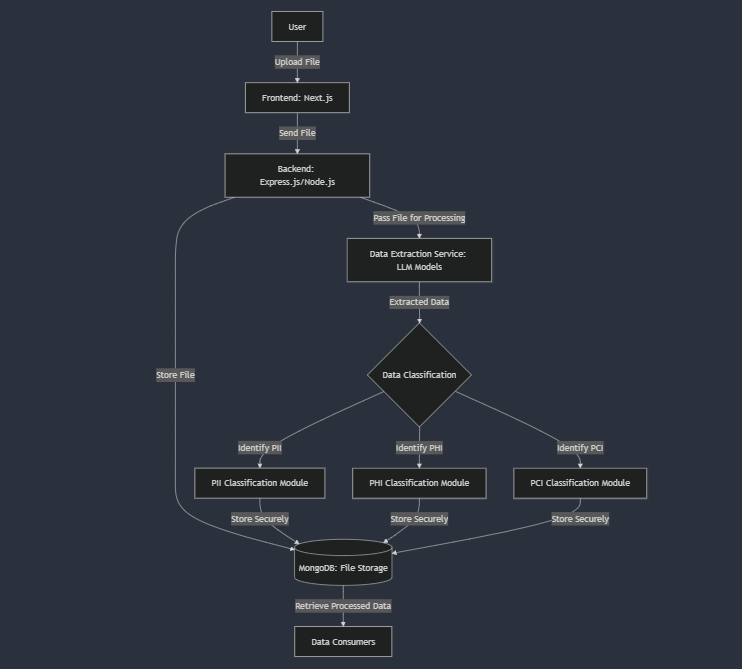

# Aurva-backend-task

# File Scanning and Data Extraction System

This system allows you to upload files (images and PDFs), process them through data extraction services, and classify the extracted data into PII, PHI, or PCI categories. The system uses advanced models such as Gemini for extracting sensitive data, with the potential to expand to other models like GPT-3.2, Mistral, Claude, or even custom-built models in the future.

**Hosted Links**:
- [Frontend](https://aurva-backend-task.vercel.app/)
- [Backend](https://aurva-backend-task-n979.vercel.app/)

Please note that the hosted services might be down at times due to server maintenance or other reasons.

## Table of Contents
- [Features](#features)
- [How It Works](#how-it-works)
- [Installation](#installation)
  - [Frontend Setup](#frontend-setup)
  - [Backend Setup](#backend-setup)
  - [Running with Docker](#running-with-docker)
- [Environment Variables](#environment-variables)
- [Usage](#usage)
- [Future Enhancements](#future-enhancements)
- [Rate Limiter](#rate-limiter)

---

## Features
- **File Upload**: Upload image or PDF files to be processed.
- **Data Extraction**: Extract sensitive information using Gemini or other AI models in the future.
- **Data Classification**: Classify the extracted data into PII, PHI, and PCI categories.
- **Secure Storage**: Store the processed data securely in MongoDB.
- **API Access**: Interact with the system through the backend API.
- **Vercel Hosting**: Both frontend and backend are hosted on Vercel for easy access.

---

## How It Works

1. **Upload**: The user uploads an image or PDF file from the frontend (built with Next.js).
2. **File Processing**: The file is sent to the backend (Express.js) where it is passed to the Gemini API (or another AI model in the future) for data extraction.
3. **Data Classification**: The extracted data is processed and classified into categories like PII (Personally Identifiable Information), PHI (Protected Health Information), and PCI (Payment Card Information).
4. **Secure Storage**: Once classified, the data is stored securely in MongoDB.
5. **Retrieve**: Authorized users or systems can retrieve processed data as needed.

---

## Installation

### Frontend Setup (Next.js)

1. Clone the repository:
   ```bash
   git clone https://github.com/your-repo/frontend.git
   cd frontend
   ```

2. Install dependencies:
   ```bash
   npm install
   ```

3. Set up environment variables. Create a `.env.local` file:
   ```bash
   NEXT_PUBLIC_API_URL="your backend hosted or locahost url
   ```

4. Run the frontend locally:
   ```bash
   npm run dev
   ```

### Backend Setup (Express.js/Node.js)

1. Clone the repository:
   ```bash
   git clone https://github.com/your-repo/backend.git
   cd backend
   ```

2. Install dependencies:
   ```bash
   npm install
   ```

3. Set up environment variables. Create a `.env.deployment` file:
   ```bash
   GEMINI_API_KEY=your-gemini-api-key
   MONGO_URI=your-mongo-uri
   ```

4. Run the backend locally:
   ```bash
   npm run start
   ```

### Running with Docker

To run the entire system using Docker Compose, follow these steps:

1. Clone both frontend and backend repositories if you haven't already:
   ```bash
   git clone https://github.com/pramaths/Aurva-backend-task.git
   ```   
2. create env with same structure as .env.development

3.  Navigate to the directory and Run the system with Docker Compose:
   ```bash
   docker-compose up
   ```

Now, you can access the frontend at `http://localhost:3000` and the backend at `http://localhost:8000`.

---

## Environment Variables

Here’s a list of environment variables you need to configure for the backend:

- **GEMINI_API_KEY**: Your API key for Gemini (or any other model you plan to use).
- **MONGO_URI**: MongoDB connection URI for storing scanned files and processed data.
- **PORT**: Port number for the backend server (default: 5000).

### `.env.deployment`
```bash
GEMINI_API_KEY=your-gemini-api-key
MONGO_URI=your-mongo-uri
```

---

## Usage

1. **Upload a file**: Go to the frontend and upload an image or PDF file.
2. **Data Extraction**: The file will be sent to the backend, where it will be processed using the Gemini API.
3. **Data Classification**: The extracted data will be classified (PII, PHI, PCI).
4. **Secure Storage**: The processed data will be securely stored in MongoDB.
5. **Retrieve Data**: You can retrieve the processed data from MongoDB through the backend API (accessible via `http://localhost:5000` or hosted backend).

---

## Future Enhancements

- **Model Expansion**: In the future, we can integrate more advanced models such as LLM 3.2, Mistral, GPT-based models, or even custom models tailored to your specific needs.
- **Advanced Data Classification**: Introduce more detailed categories or models for identifying other sensitive data types.
- **Performance Optimizations**: Improve the data extraction and classification speed through more efficient processing pipelines.

---


## Video Demonstration

![System Demo]  

[Watch the demo video here](./demo.mp4)

---

## Notes

- **Hosted URLs**: The hosted system may experience downtime from time to time due to server maintenance or other unforeseen issues.
- **Local Setup**: You can run the frontend and backend separately or together using Docker Compose for local development.

---

